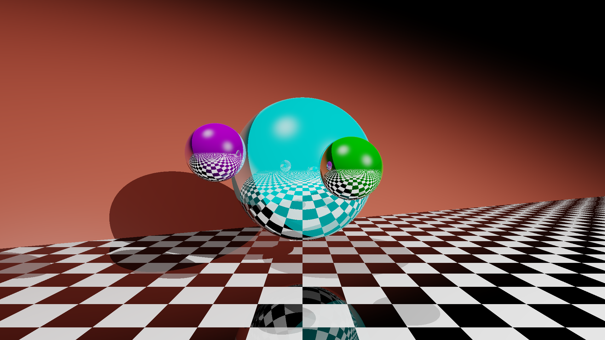

# py-raytracer
A simple Blinn-Phong ray tracer using Python and NumPy.

To-do:
- More shapes
- Orientable planes
- Refraction/translucence
- JSON file for objects and lights
- Soft shadows
- Easier way to position the camera